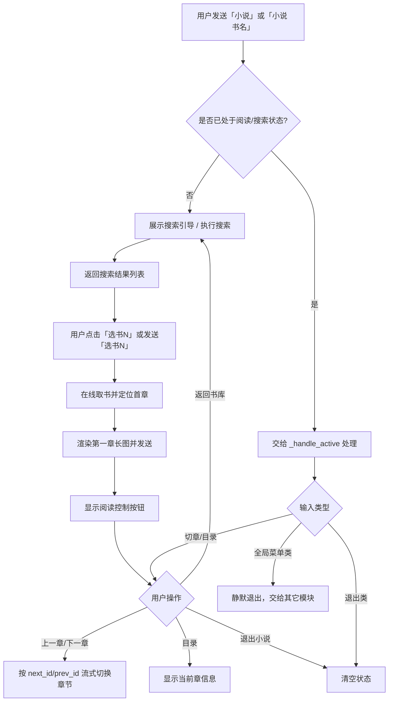

# 小说系统 — 在线搜索阅读功能配置与流程

> 更新时间：2026-08-15
> 数据源：在线小说源（搜索 + 按章阅读）

## 一、功能配置

### 1.1 总开关

- 开关 key：`novel`
- 判断入口：`is_feature_enabled("novel", appid=ctx.bot_appid)`
- 默认状态：**开启**（未配置时返回 True）
- 配置位置：控制台「功能开关」页面，或持久化的 `_bot_system_switches` / `_system_switches`
- 关闭后行为：
  - 菜单中「小说菜单」入口仍会显示（导航类按钮不受子开关控制）
  - 小说插件分发分支直接返回，不再响应任何小说指令
  - 已处于阅读状态的用户，收到小说相关指令时也会静默退出

### 1.2 依赖清单

| 组件 | 路径 | 说明 |
|------|------|------|
| 业务模块 | `modules/novel_system.py` | 状态机、搜索、阅读控制、键盘按钮 |
| 在线源 | `modules/qishuxia.py` | 在线搜索、取书、取章节（标准库实现） |
| 渲染器 | `data/render_novel.py` | PIL 把章节正文渲染成整章长图 |
| 用户状态 | `data/novel_states.json` | 每个 `storage_id` 的阅读状态 |
| 图片缓存 | `data/cache/novel_img/` | 渲染后的章节长图（运行中生成） |

### 1.3 关键运行参数

| 参数 | 取值 | 说明 |
|------|------|------|
| 搜索返回上限 | 10 本 | `search_books(keyword, limit=10)` |
| 长图最大高度 | 8000 像素 | 超长章节按段落边界切分为多张长图 |
| 长图宽度 | 720 像素 | 正文区宽度 600 像素 |
| 示例书名池 | `_POPULAR` | 斗破苍穹、大奉打更人、诡秘之主、凡人修仙传、全职高手等 |

---

## 二、功能流程图



---

## 三、状态机

```
idle ──> search（保存 keyword + results）──> reading（保存 book_id / chapter_id）
                    ↑                              │
                    └──── 返回书库 / 退出 ─────────┘
```

状态字段：

| 字段 | 类型 | 说明 |
|------|------|------|
| `mode` | str | `search` 或 `reading` |
| `book_id` | str | 在线书籍 ID |
| `book_title` | str | 书名 |
| `book_author` | str | 作者（可能为空） |
| `chapter_id` | str | 当前章节 ID（来自在线源） |
| `chapter_idx` | int | 当前是第几章（从 1 开始，用于展示） |
| `results` | list | `search` 模式下的搜索结果 |
| `keyword` | str | `search` 模式下的搜索关键词 |

---

## 四、命令协议

| 用户输入 | 行为 |
|---------|------|
| `小说` / `看小说` / `读书` / `看书` / `在线阅读` | 进入搜索引导 |
| `小说 书名` / `看 书名` / `读 书名` | 直接搜索，例如 `小说 斗破苍穹` |
| `小说 随机推荐` / `小说 随机` | 从热门池随机搜索一本书 |
| `选书N` / 点击「选书N」按钮 | 进入搜索结果第 N 本书的首章 |
| `上一章` / `下一章` / `上章` / `下章` | 按在线源链接切换章节（正文为整章长图，无需翻页） |
| `目录` / `章节列表` / `章节` | 显示当前章信息（在线源暂无完整目录） |
| `返回书库` / `书库` / `返回` | 回到搜索引导 |
| `退出小说` / `不看了` / `结束阅读` / `退出阅读` / `退出` | 清空阅读状态 |
| 阅读中发送其它模块入口（菜单/帮助/签到等） | 静默退出小说，交给对应模块 |

---

## 五、键盘按钮布局

### 搜索引导页
- 每行 2 个按钮
- 示例：`斗破苍穹`、`大奉打更人`、`诡秘之主`、`随机推荐`、`退出`

### 搜索结果页
- 每行 2 个按钮
- 按钮文本：`1.《斗破苍穹》`、`2.《大奉打更人》` 等
- 最后一行：`退出`

### 阅读控制页
- 每行 3 个按钮
- 第一行：`上一章`、`下一章`、`目录`
- 第二行：`返回书库`、`退出`

> 说明：阅读控制按钮已去掉 emoji、减小每行密度，避免手机屏幕宽度不足导致文字被截断成「…」。
> 正文以整章长图呈现，用户上滑即可查看完整内容，无需再分「上一页 / 下一页」。

---

## 六、端到端验证

- `py_compile` 通过：`modules/novel_system.py`、`modules/qishuxia.py`、`data/render_novel.py`
- 联网实测：搜索「斗破苍穹」→ 返回结果 → 进入首章 → 渲染整章长图（约 3700 像素）→ 下一章链接链式跟随成功
- 状态机模拟（stub 掉 botpy）：入口 → 搜索 → 选书 → 长图 → 下一章长图 → 目录 → 退出 → 不再接管，全部通过
- 分段测试：3 倍长度正文能正确切分为两张长图（7869 + 3084 像素），按段落边界切分，无切断段落

---

## 七、相关路径

- 业务模块：`C:\Users\123\Desktop\小流萤bot\modules\novel_system.py`
- 在线源：`C:\Users\123\Desktop\小流萤bot\modules\qishuxia.py`
- 渲染器：`C:\Users\123\Desktop\小流萤bot\data\render_novel.py`
- 用户状态：`C:\Users\123\Desktop\小流萤bot\data\novel_states.json`
- 图片缓存：`C:\Users\123\Desktop\小流萤bot\data\cache\novel_img\`
- 菜单配置：`C:\Users\123\Desktop\小流萤bot\bot.py` 中 `_CATEGORY_CONFIG["小说菜单"]`
